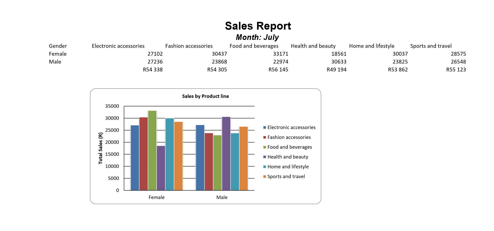

# Automated Excel Sales Report

A Python tool that turns raw sales data into a formatted Excel report — complete with a styled title, a pivot table, calculated totals, and a bar chart — generated with a single command.



## Output

Given a month name as input, the tool generates a ready-to-share `report_<month>.xlsx` containing:

- A centered, styled title and month subtitle
- A Gender × Product line pivot table summarizing total sales
- A totals row formatted as currency (Rand)
- A clustered bar chart comparing product line sales by gender, with axis titles and a legend
- Auto-sized columns for a clean, print-ready layout

## What It Does

- Reads raw transaction data from `supermarket_sales.xlsx`
- Builds a pivot table summarizing total sales by Gender and Product line
- Applies formatting: merged/centered headings, fonts, currency number formats, auto column widths
- Generates a bar chart directly from the pivot table data
- Saves and automatically opens the finished report

## Technologies Used

- Python
- Pandas (data aggregation via pivot tables)
- openpyxl (Excel formatting and charting)
- PyInstaller (packaged as a standalone `.exe`)

## Requirements

- Python 3.x
- `supermarket_sales.xlsx` present in the project directory

## Installation

1. Clone the repository:
   ```bash
   git clone https://github.com/yourusername/your-repo.git
   ```

2. Install dependencies:
   ```bash
   pip install pandas openpyxl
   ```

3. Run the script:
   ```bash
   python automate_excel.py
   ```

   When prompted, enter a month name (e.g. `July`). The report opens automatically once it's generated.

## Use Case

This project demonstrates end-to-end report automation — turning raw spreadsheet data into a polished, presentation-ready Excel report without manual formatting. Useful for recurring reporting workflows (monthly sales, KPIs, etc.) where the same formatting needs to be applied to fresh data on a regular basis.
